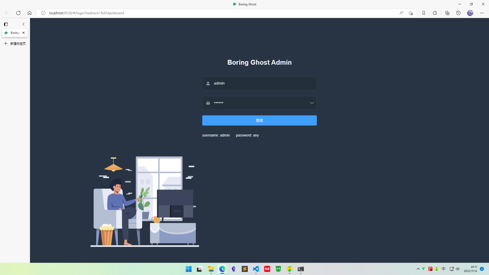
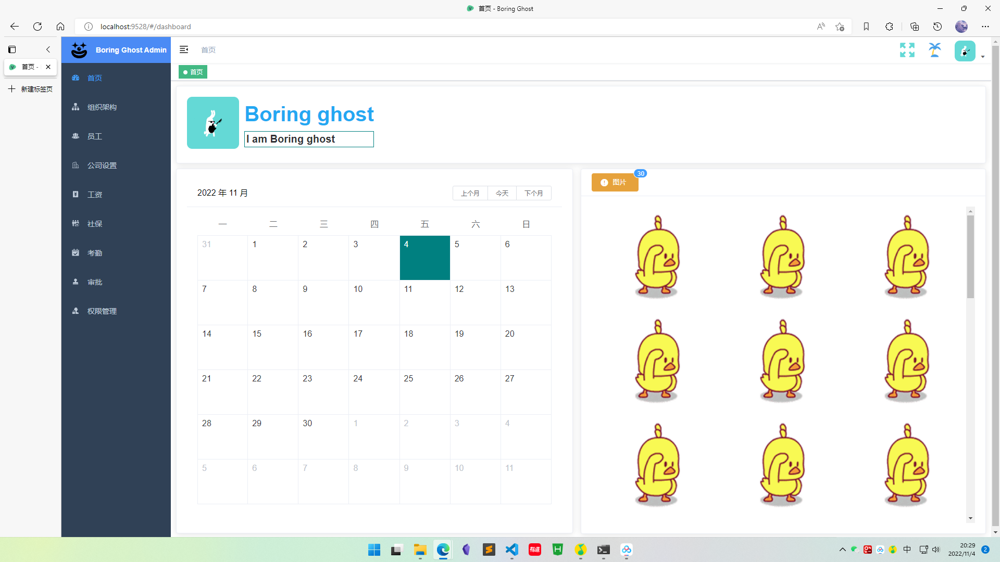
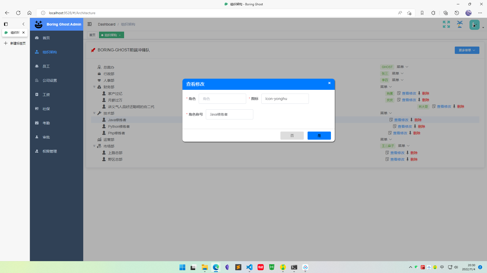
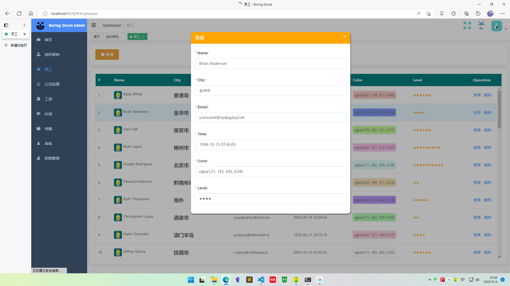
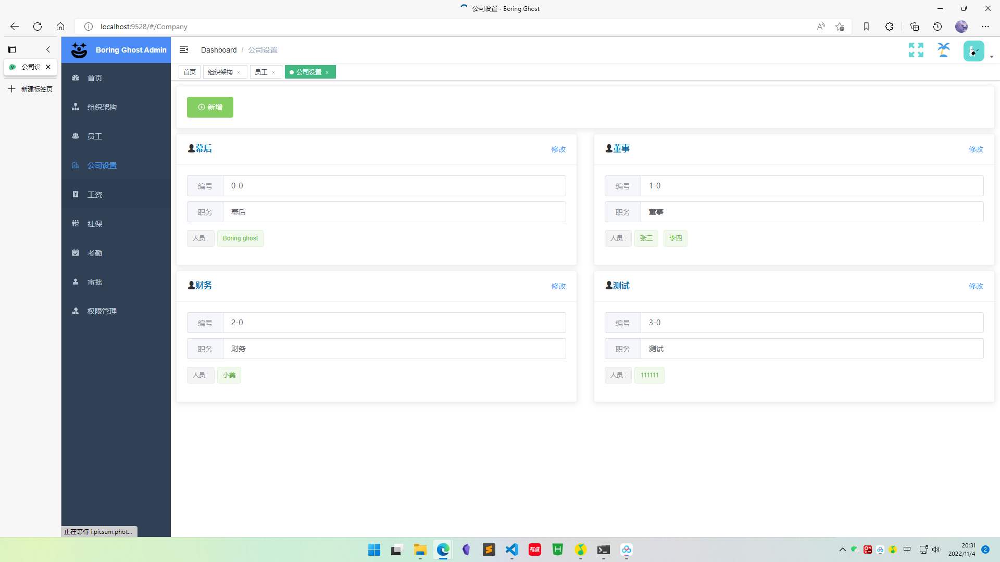
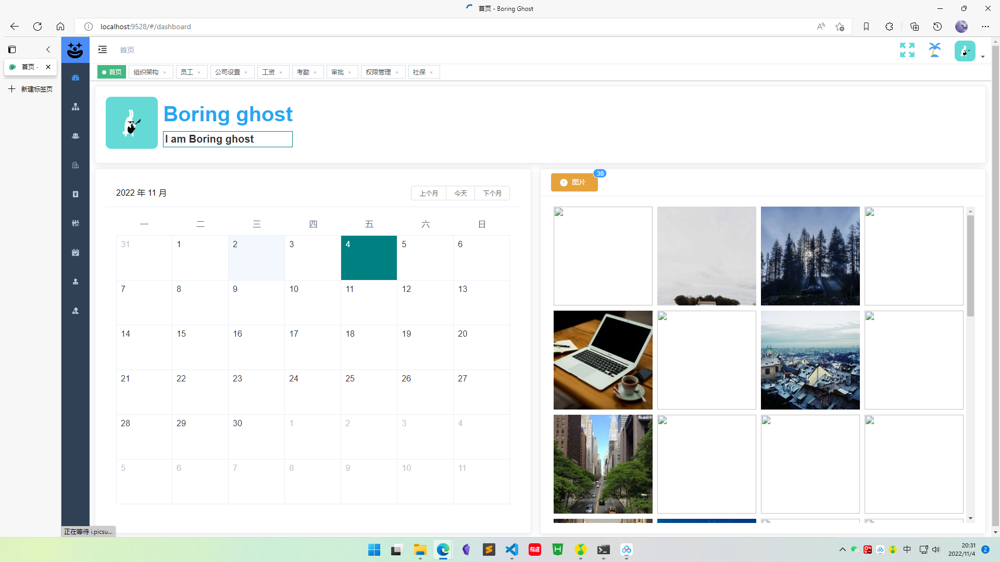

# 后台小案例

前端: element-admin-template
后端: node

# 启动

一:拉取代码

```
git clone git@github.com:mfxhb/vue-admin-eleAdminProV2.git
```

二 :启动服务

```
// 安装serve目录的依赖
yarn
// 启动服务
yarn start
```

三:启动前端

```
// 安装web-code目录的依赖
yarn
// 启动项目
yarn serve
```

---

### 用的第三方

- i18n

```
Plugins/
zh.js en.js 中配置相关内容
```

- element ui
- iconfont
- Toast

```
Plugins/Glob-Fn/Toast
单独封装
```

- modal

```
单独封装
```

- Loading

```
从element中抽离了出来
```

- xe-utils vxe-table@3
- vee-validate@3

### 效果












